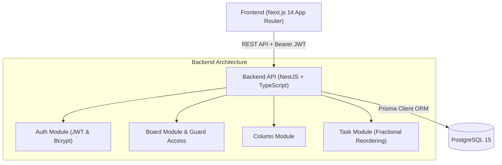

# Mini Kanban Board Monorepo Application

A production-ready, clean, and maintainable "Mini Kanban Board" monorepo application built with **NestJS**, **Next.js (App Router)**, **TypeScript**, **PostgreSQL**, **Prisma ORM**, and **Tailwind CSS**.

---

## 🌟 Key Features

- **Monorepo Architecture**: Clean separation of concerns with `/backend`, `/frontend`, and root Docker Compose orchestration.
- **NestJS Backend**: Modular architecture with Controllers, Services, Repositories (Prisma), DTO validations (`class-validator`), and JWT authentication.
- **Relational Data Schema**: Prisma ORM models for `User`, `Board`, `BoardMember` (explicit junction table with unique `[boardId, userId]` constraint), `Column`, and `Task`.
- **Security & Access Control**:
  - `JwtAuthGuard` to protect private endpoints.
  - `BoardAccessGuard` verifying ownership or collaborator permissions before any read/write operations to prevent cross-board data leaks.
- **Conflict-Free Task Reordering (`PATCH /api/tasks/:id/move`)**:
  - Implements fractional indexing (`orderIndex` as Float) with automatic column rebalancing when order precision gaps fall below threshold (`< 0.0001`).
- **Interactive Drag-and-Drop Frontend**:
  - Next.js 14 App Router, Tailwind CSS, Lucide icons, and `@hello-pangea/dnd`.
  - Optimistic UI drag updates with automatic rollback on network sync errors.
  - Full board management (Create Board, Invite Collaborators by Email, Add/Edit/Delete Columns, Add/Edit/Assign/Delete Tasks).

---

## 🏗️ Architecture Overview



---

## 🚀 Quick Start with Docker Compose

Spin up the entire stack (PostgreSQL, NestJS Backend, and Next.js Frontend) with a single command:

```bash
docker-compose up --build
```

- **Frontend**: [http://localhost:3000](http://localhost:3000)
- **Backend API**: [http://localhost:4000/api](http://localhost:4000/api)
- **PostgreSQL**: `localhost:5432`

---

## 🛠️ Manual Local Development Setup

### Prerequisites
- **Node.js**: v18+ or v20+
- **PostgreSQL**: v15+ running locally (or via Docker `docker run -p 5432:5432 -e POSTGRES_PASSWORD=kanban_secret -e POSTGRES_USER=kanban_user -e POSTGRES_DB=kanban_db postgres:15-alpine`)

### 1. Environment Setup
Copy `.env.example` to `.env` in the root directory:
```bash
cp .env.example .env
```

### 2. Backend Setup (`/backend`)
```bash
cd backend
npm install

# Run database migrations
npx prisma migrate dev --name init

# Seed initial test data (Users, Sample Board, Columns, Tasks)
npm run prisma:seed

# Start NestJS development server
npm run start:dev
```
Backend will start on `http://localhost:4000/api`.

### 3. Frontend Setup (`/frontend`)
```bash
cd frontend
npm install

# Start Next.js development server
npm run dev
```
Frontend will start on `http://localhost:3000`.

---

## 🔑 Demo Login Credentials (From Seed Script)

- **User 1 (Board Owner)**:
  - Email: `john@example.com`
  - Password: `Password123!`
- **User 2 (Board Collaborator)**:
  - Email: `jane@example.com`
  - Password: `Password123!`

---

## 📡 API Contract Specification

### Auth Endpoints (`/api/auth`)
| Method | Endpoint | Description | Auth Required |
| font | --- | --- | --- |
| `POST` | `/api/auth/register` | Register new user | No |
| `POST` | `/api/auth/login` | Authenticate user & issue JWT | No |
| `GET` | `/api/auth/me` | Fetch active user profile | Yes (Bearer Token) |

### Board Endpoints (`/api/boards`)
| Method | Endpoint | Description | Auth Required |
| --- | --- | --- | --- |
| `GET` | `/api/boards` | Get user owned and shared boards | Yes |
| `POST` | `/api/boards` | Create a new board | Yes |
| `GET` | `/api/boards/:id` | Get board details with columns & tasks | Yes (Member Guard) |
| `PUT` | `/api/boards/:id` | Update board title/description | Yes (Member Guard) |
| `DELETE` | `/api/boards/:id` | Delete board | Yes (Owner Only) |
| `POST` | `/api/boards/:id/members` | Invite collaborator by email | Yes (Owner Only) |
| `DELETE` | `/api/boards/:id/members/:userId` | Remove collaborator | Yes (Owner Only) |

### Column Endpoints (`/api/columns`)
| Method | Endpoint | Description | Auth Required |
| --- | --- | --- | --- |
| `POST` | `/api/columns` | Create new column in board | Yes (Member Guard) |
| `PUT` | `/api/columns/:id` | Update column title | Yes (Member Guard) |
| `DELETE` | `/api/columns/:id` | Delete column | Yes (Member Guard) |
| `PATCH` | `/api/columns/:id/move` | Move column position | Yes (Member Guard) |

### Task Endpoints (`/api/tasks`)
| Method | Endpoint | Description | Auth Required |
| --- | --- | --- | --- |
| `POST` | `/api/tasks` | Create task in column | Yes (Member Guard) |
| `PUT` | `/api/tasks/:id` | Update task title, description, assignee | Yes (Member Guard) |
| `DELETE` | `/api/tasks/:id` | Delete task | Yes (Member Guard) |
| `PATCH` | `/api/tasks/:id/move` | Reorder/move task (`{ targetColumnId, newPositionIndex }`) | Yes (Member Guard) |

---

## 🗄️ Database Schema Summary (`prisma/schema.prisma`)

- **`User`**: `id`, `email`, `passwordHash`, `name`, `createdAt`, `updatedAt`
- **`Board`**: `id`, `title`, `description`, `ownerId`, `createdAt`, `updatedAt`
- **`BoardMember`**: `id`, `boardId`, `userId`, `role` (`OWNER` / `COLLABORATOR`), `createdAt` (Unique constraint `[boardId, userId]`)
- **`Column`**: `id`, `boardId`, `title`, `orderIndex` (Float), `createdAt`, `updatedAt`
- **`Task`**: `id`, `columnId`, `title`, `description`, `orderIndex` (Float), `assignedToId`, `createdAt`, `updatedAt`

---

## 🧪 Verification & Testing

- **Backend Build**: `npm run build` inside `/backend`
- **Frontend Build**: `npm run build` inside `/frontend`
- **Docker Stack**: `docker-compose up --build`
